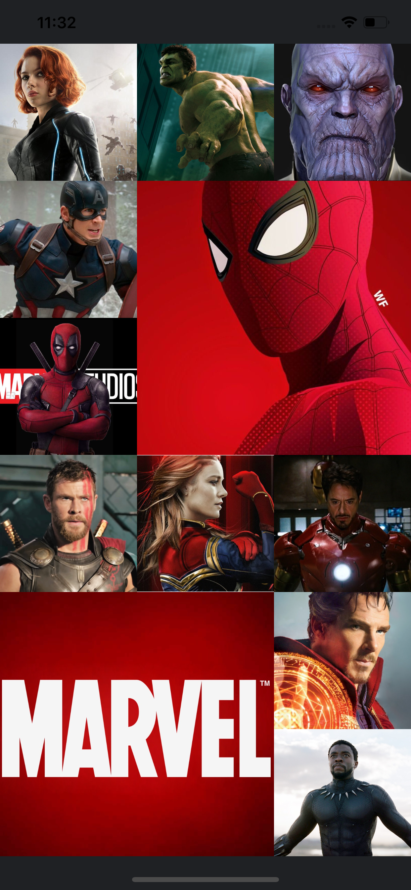
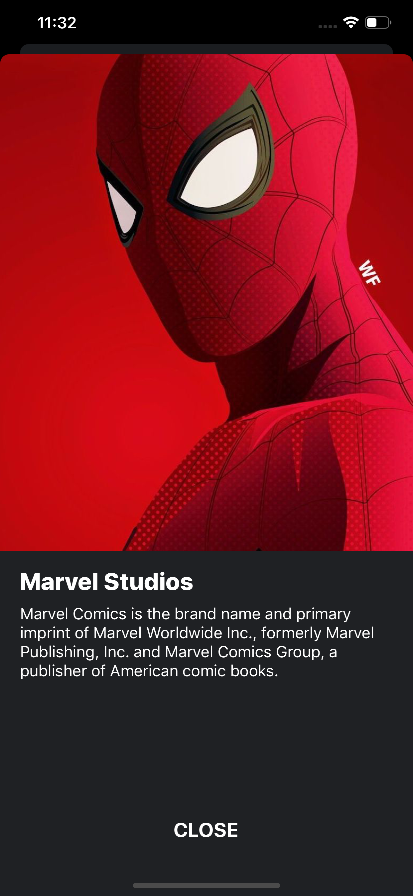

# UICollectionView with Custom Flow layOut and 3d Touch Transation.

 
 

### Note**: While the iOS Simulator does provide support for 3D Touch, your computer or Trackpad must have Force Touch enabled. Even with Force Touch enabled, the gesture can be tricky to get the hang of. I recommend you follow along with a 3D Touch enabled device, if at all possible.

## 🚀 Contributing
⚙ Made by: Mohamed Gamal
